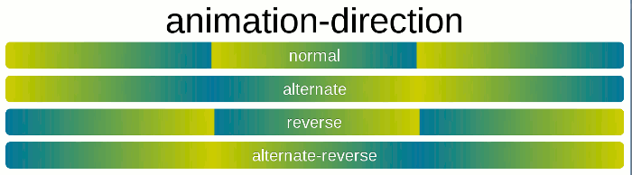

前端

[1.	基础	1](#_102)

>   [1.1.	html5	1](#_105)

>   [1.1.1.	新特性	2](#_128)

>   [1.2.	动画	2](#_107)

>   [1.2.1.	css实现	2](#_300)

>   [1.2.2.	画布实现	10](#_301)

>   [1.2.3.	js实现	10](#_302)

>   [1.2.4.	requestAnimaitonFrame	10](#_307)

>   [1.2.5.	子主题	10](#_376)

>   [1.3.	css3	10](#_106)

>   [1.3.1.	盒子模型	10](#_129)

>   [1.3.2.	position定位	13](#_112)

>   [1.3.3.	选择器	14](#_130)

>   [1.3.4.	元素居中	14](#_133)

>   [1.3.5.	float浮动	14](#_136)

>   [1.3.6.	display属性	14](#_139)

>   [1.3.7.	可继承的属性	15](#_144)

>   [1.3.8.	常见问题	15](#_145)

>   [1.4.	js	15](#_166)

>   [1.4.1.	数据类型	15](#_168)

>   [1.4.2.	闭包	22](#_169)

>   [1.4.3.	原型&原型链	22](#_170)

>   [1.4.4.	继承	22](#_173)

>   [1.4.5.	事件循环机制	22](#_171)

>   [1.4.6.	事件代理&事件冒泡	23](#_172)

>   [1.4.7.	垃圾回收	23](#_174)

>   [1.4.8.	内存泄漏	23](#_175)

>   [1.4.9.	作用域&作用域链	23](#_176)

>   [1.4.10.	设计模式	24](#_177)

>   [1.4.11.	BOM	24](#_195)

>   [1.4.12.	DOM	24](#_196)

>   [1.4.13.	常见问题	24](#_200)

>   [1.4.14.	小技巧	24](#_287)

>   [1.5.	es6	27](#_167)

>   [1.5.1.	变量申明(不存在变量提升，作用范围是一个大括号)	27](#_197)

>   [1.5.2.	promise	28](#_198)

>   [1.5.3.	async & await	28](#_199)

>   [1.5.4.	class	28](#_220)

>   [1.5.5.	箭头函数	28](#_211)

>   [1.5.6.	解构赋值	28](#_212)

>   [1.5.7.	新增方法	28](#_213)

>   [1.5.8.	Set & Map	28](#_216)

>   [1.5.9.	proxy	28](#_217)

>   [1.5.10.	Iterator & for...of	28](#_416)

[2.	框架	28](#_103)

>   [2.1.	vue	28](#_110)

>   [2.1.1.	router	28](#_146)

>   [2.1.2.	组件间通信方式	28](#_147)

>   [2.1.3.	computed	44](#_160)

>   [2.1.4.	生命周期	44](#_162)

>   [2.1.5.	diff算法	44](#_163)

>   [2.1.6.	keep-alive	44](#_165)

>   [2.1.7.	常见问题	44](#_148)

[3.	算法	44](#_104)

>   [3.1.	复杂度	44](#_333)

>   [3.1.1.	时间复杂度	44](#_342)

>   [3.1.2.	空间复杂度	44](#_343)

>   [3.2.	字符串	44](#_332)

>   [3.2.1.	String的api	45](#_344)

>   [3.2.2.	leecode	45](#_345)

>   [3.3.	数字	45](#_334)

>   [3.4.	数组	45](#_335)

>   [3.4.1.	子主题	45](#_430)

>   [3.4.2.	数组最大的特点就是：支持随机访问。但插入和删除的平均时间复杂度是O(n)	45](#_429)

>   [3.5.	链表	45](#_336)

>   [3.6.	二叉树	45](#_337)

>   [3.7.	动态规划	45](#_338)

>   [3.8.	回溯算法	45](#_339)

>   [3.9.	排序与搜索	45](#_340)

>   [3.10.	栈与队列	45](#_341)

>   [3.11.	v8	45](#_346)

[4.	模块化规范	45](#_178)

>   [4.1.	commonjs	45](#_179)

>   [4.1.1.	node	45](#_183)

>   [4.2.	AMD	45](#_180)

>   [4.3.	CMD	45](#_181)

>   [4.4.	ES6	46](#_182)

[5.	小技巧	46](#_237)

>   [5.1.	console	46](#_238)

>   [5.1.1.	console.count()：特定的值使用了多少次	46](#_239)

>   [5.1.2.	console.time()和console.timeEnd():
>   结合使用，一个代码块或者函数执行了多长时间	46](#_240)

[6.	网络	46](#_121)

>   [6.1.	https和http对比	46](#_125)

>   [6.2.	三次握手	46](#_126)

>   [6.3.	四次挥手	46](#_127)

[7.	优化	46](#_122)

>   [7.1.	性能优化	46](#_123)

>   [7.1.1.	for循环中的	46](#_377)

>   [7.2.	安全优化	47](#_124)

[8.	操作系统	47](#_143)

[9.	打包	47](#_109)

>   [9.1.	webpack	47](#_111)

# 基础

## html5

### 新特性

## 动画

### css实现

>   [新链接](http://www.ruanyifeng.com/blog/2014/02/css_transition_and_animation.html)

#### transition

##### 使用方法

###### transition-property: width/... 某一属性

###### transition-duration: 1s/ms/... 持续时间

###### transition-delay: 1s/ms/... 推迟开始时间

###### transition-timing-function: ease/... 状态变化速度(默认不是匀速，而是逐渐变慢，即ease)

##### 使用注意

###### 各大浏览器都支持(IE10)

###### 有些css属性不支持transition

###### 必须有开始状态和结束状态的 具体数值，才可以计算出中间状态

>   例如：如果width是从1px到90px，可以计算出中间的数值；
>   但是如果是width是auto，则无法计算出中间状态，不会产生动画效果。
>   类似的情况还有，display: none到block，background:
>   url(foo.jpg)到url(bar.jpg)等等

##### 不足之处

###### 需要事件触发，无法在浏览器加载时自动执行

###### 是一次性的，无法重复执行，除非重复触发

###### 只能定义开始状态和结束状态，无法定义中间状态，即只有两个状态

###### 一条transition规则，只能定义一个属性的变化，无法定义多个属性

##### 注意

###### 在移动端中，如果直接使用transition会使页面变慢或者卡顿

###### 通常使用 transform: translate3D(0, 0, 0) 或者 transform: translateZ(0) 来开启移动端动画的GPU加速，从而使动画流畅

#### animation

##### 基本使用

###### 子主题

>   \#div1:hover { animation: 1s rainbow; } // 动画的名字 @keyframes rainbow {
>   0% { background-color: red;} 50% { background-color: yellow;} 100% {
>   background-color: blue;} }

##### animation-iteration-count: 1(默认)/2/... infinite(无限循环)

##### animation-fill-mode: 动画结束后的状态 （动画结束后会立即从结束状态跳到开始状态）

###### forwards：保持在动画结束的状态

###### none: 回到动画未开始的状态（默认值）

###### backwards: 动画回到第一帧

###### both: 根据animation-direction轮流应用forwards和backwards规则

###### 子主题

>   \#div1:hover { animation: 1s rainbow forwards; } @keyframes rainbow { 0% {
>   background-color: red;} 50% { background-color: yellow;} 100% {
>   background-color: blue;} }

##### animation-direction: 动画重复播放的方式 （动画循环时，默认都是从结束状态直接跳回开始状态, 再开始播放）

###### normal: 从开始状态播放（默认值）

###### reverse

###### alternate

###### alternate-reverse

###### Topic1

>   

###### 子主题

>   \#div1:hover { animation: 1s rainbow 3 alternate; } @keyframes rainbow { 0%
>   { background-color: red;} /\* 50% { background-color: yellow;} \*/ 100% {
>   background-color: blue;} }

##### animation-play-state: 动画突然停止时的状态 （动画突然停止时，默认是跳到开始的状态）

###### running：动画正在播放

###### paused：动画暂停

###### 子主题

>   \#div1 { height:150px; width:150px; background-color: burlywood; animation:
>   1s rainbow linear 1s 3 forwards alternate; /\* 鼠标没有悬停时，动画暂停 \*/
>   animation-play-state: paused; } \#div1:hover { /\* 鼠标悬停，动画继续播放
>   \*/ animation-play-state: running; } @keyframes rainbow { 0% {
>   background-color: red;} 50% { background-color: yellow; transform:
>   scale(1.2);} to { background-color: blue;} }

##### animation是真正意义上的css3动画，摆脱了js的控制

##### 子主题

###### \#div1:hover { animation: 1s rainbow linear 1s 3 forwards alternate; /\* animation-name: rainbow; animation-duration: 1s; animation-timing-function: linear; animation-delay: 1s; animation-fill-mode: forwards; animation-iteration-count: 3; animation-direction: alternate; \*/ /\* 浏览器从一个状态向另一个状态过渡，是平滑过渡，steps函数可以实现分步过渡 \*/ /\* animation: 1s rainbow infinite steps(10); \*/ } @keyframes rainbow { 0% { background-color: red;} 50% { background-color: yellow; transform: scale(1.2);} to { background-color: blue;} }

### 画布实现

#### svg可伸缩矢量图形

#### canvas画布

##### 描述

###### canvas是h5新增元素，使用web api完成各种绘制

##### 绘制方法

###### getContext('2d')获取元素的绘制功能；clearRect()不断清除画布；fillStyle()重新绘制

###### 也是借助setInterval() ？？？？

### js实现

#### 主要是通过setInterval或者setTimeout回调函数，改变css的样式，实现

#### 缺点

##### 通常会导致页面频繁重绘重排，尤其在移动端设备上，会出现卡顿现象

### requestAnimaitonFrame

### 子主题

## css3

### 盒子模型

#### 盒模型类型

##### 标准盒模型 和 IE盒模型

#### 区别

##### 计算width和height的方式不同

###### 标准盒模型的width和height包括：

>   Topic1

###### IE盒模型的width和height包括：

>   Topic1

##### css设置方式

###### box-sizing

>   content-box: 标准盒模型，浏览器默认

>   border-box：IE盒模型

#### js获取盒模型的width和height

##### dom.style.width/height

###### 此api仅能拿到 元素内联样式 的宽高

##### dom.currentStyle.width/height

###### 仅IE支持，拿到 浏览器渲染后 dom元素的宽高

##### window.getComputedStyle(dom).width/height

###### 仅weikit支持，拿到 浏览器渲染后 dom元素的宽高

##### dom.getBoundingClientRect.widht/height

###### 用于计算当前元素 相对于当前viewport视口 的左上角定点 的绝对位置

#### BFC

##### 什么是BFC

###### Formatting context(格式化上下文)是W3C css2.1规范中的一个概念。 其是页面中的一块渲染区域，有自己的渲染规则。 它决定了其子元素如何定位，及与其它元素的 关系 与 相互作用。

###### Block Formatting context(块级格式化上下文) 是上述规范中的一种。 可以看作是一块隔离了的 独立容器。 容器里的元素 不会在 布局上 影响 外面 的元素

##### BFC的 特性 及 应用场景

>   [新链接](https://github.com/2653516511/Font-mindMaster/commit/e9ab02e85e91d0e6f83d07902a029f048182da76)

##### 怎样可以触发BFC

###### 浮动元素float

>   除了none以外的值

###### 绝对定位元素position

>   absolute、fixed

###### display

>   inline-block、table-cells、flex

###### overflow

>   hidden、auto、scroll（除visible以外的值）

##### 学习资料

###### BFC原理刨析

>   [新链接](https://github.com/zuopf769/notebook/blob/master/fe/BFC%E5%8E%9F%E7%90%86%E5%89%96%E6%9E%90/README.md)

###### BFC学习

>   [新链接](https://juejin.cn/post/6844903495108132877)

### position定位

#### absolute

##### 相对的是：向上查找第一个position是非static的元素

#### relative

##### 相对的是：它本来的位置

#### flex

##### 相对的是：屏幕的位置

#### static

##### 默认是static

### 选择器

#### 种类

#### 优先级

### 元素居中

#### 水平居中

#### 垂直居中

### float浮动

#### 会导致什么问题

#### 如何解决

### display属性

#### inline

#### block

#### inline-block

### 可继承的属性

### 常见问题

## js

### 数据类型

#### 基本数据类型

##### null, undefine, string, number, boolean, stymbol, bigint

#### 引用数据类型

##### 引用类型 和 引用类型 是 不相等的。因为他们的地址是不一样的，除非指向同一个地址，才会相等

>   {} == {}

>   false

>   [] === []

>   false

>   3 === 3

>   true

>   null === null

>   true

>   undefined === undefined

>   true

######  {} == {} false [] === [] false 3 === 3 true null === null true undefined === undefined true

##### Array数组

###### 操作方法

>   Topic1

###### 注意：一直以来，我都以为所有语言中的数组都是一样的，存储空间是一段连续的空间，但是js中的引用数据类型和基本数据类型的不用点中又说，引用数据类型是存储在堆中的，而堆中的空间又是不连续的、手动分配的，有点矛盾，今天突然看到，原来js中的数组和别的语言中的不同，他的数据在内存中可以不是连续的、并且长度可以随时改变。

###### 在js中，严格来说，数组应该被成为对象，数组的索引是他的属性，这些数字索引会被转化位字符串。可以使用对象的方法，例如Object.keys()。但有时为了性能考虑，还是严格按照数组的方法进行操作，例如不建议对数组增加属性

##### Object对象

###### 注意：在js中，对象的属性名必须是字符串

##### RegExp正则

##### Data日期

##### Function

##### Math数学

#### 区别

#### 识别数据类型的方法

##### typeof

>   1\. 对于基本数据类型，除了null， typeof都可以识别

>   2\. typeof 将null识别为'object'

>   3\. 对于引用数据类型，typeof只可识别函数为'function', 别的都识别为'object'

>   总结：typeof无法有效识别引用类型的数据

>   [新链接](https://github.com/2653516511/Font-mindMaster/blob/master/%E5%9F%BA%E7%A1%80/JS/%E6%95%B0%E6%8D%AE%E7%B1%BB%E5%9E%8B/%E8%AF%86%E5%88%AB%E6%95%B0%E6%8D%AE%E7%B1%BB%E5%9E%8B%E7%9A%84%E6%96%B9%E6%B3%95/typeof.js)

###### 1. 对于基本数据类型，除了null， typeof都可以识别 2. typeof 将null识别为'object' 3. 对于引用数据类型，typeof只可识别函数为'function', 别的都识别为'object' 总结：typeof无法有效识别引用类型的数据

##### instanceof

>   instanceof的**原理**是：在原型链上查找，返回值是true/false

>   1\. 由于**基本数据类型**不存在原型，所以无法使用instanceof检测

>   2.
>   对于**引用数据类型**，由于原型链的终端是Object，都是Object的实例，如果用Object都会返回true。所以应具体化是某一类型，如Array,
>   Data等

>   3\. 对于数组，可以使用其本身的方法 Array.isArray() 进行判断

>   [新链接](https://github.com/2653516511/Font-mindMaster/blob/master/%E5%9F%BA%E7%A1%80/JS/%E6%95%B0%E6%8D%AE%E7%B1%BB%E5%9E%8B/%E8%AF%86%E5%88%AB%E6%95%B0%E6%8D%AE%E7%B1%BB%E5%9E%8B%E7%9A%84%E6%96%B9%E6%B3%95/instanceof.js)

###### instanceof的原理是：在原型链上查找，返回值是true/false 1. 由于基本数据类型不存在原型，所以无法使用instanceof检测 2. 对于引用数据类型，由于原型链的终端是Object，都是Object的实例，如果用Object都会返回true。所以应具体化是某一类型，如Array, Data等 3. 对于数组，可以使用其本身的方法 Array.isArray() 进行判断

##### Object.prototype.toString.call()

#### 类型转换

>   [新链接](https://github.com/2653516511/Font-mindMaster/blob/master/%E5%9F%BA%E7%A1%80/JS/%E6%95%B0%E6%8D%AE%E7%B1%BB%E5%9E%8B/%E7%B1%BB%E5%9E%8B%E8%BD%AC%E6%8D%A2.js)

#### 常见问题

##### ‘a'.toString()为什么可以调用

##### 0.1+0.2 = 0.3?

>   计算机中是以 二进制 进行计算的。

>   0.1 和 0.2在转换为二进制时，会无限循环

>   由于 标准位数 的限制，后面的位数会 被截掉，出现 精度损失

>   相加后因 浮点数小数位的限制 而 截断的二进制数字 =\>
>   十进制：0.30000000000000004

>   0.1+0.2 == 0.3

>   false

>   0.1+0.2 == 0.30000000000000004

>   true

>   0.1+0.2 == 0.3

>   false

>   0.1+0.1 == 0.2

>   true

>   0.1+0.1 == 0.20000000000000000345

>   true

###### 子主题

>   计算机中是以 二进制 进行计算的。 0.1 和 0.2在转换为二进制时，会无限循环 由于
>   标准位数 的限制，后面的位数会 被截掉，出现 精度损失 相加后因
>   浮点数小数位的限制 而 截断的二进制数字 =\> 十进制：0.30000000000000004
>   0.1+0.2 == 0.3 false 0.1+0.2 == 0.30000000000000004 true 0.1+0.2 == 0.3
>   false 0.1+0.1 == 0.2 true 0.1+0.1 == 0.20000000000000000345 true

##### 怎么终止forEach操作？

###### 子主题

### 闭包

#### 什么是闭包？

>   红宝书(三p178)：闭包是指 有权访问 另外一个函数作用域中的变量 的函数

>   mdn：https://developer.mozilla.org/en-US/docs/Web/JavaScript/Closures

##### 子主题

###### 红宝书(三p178)：闭包是指 有权访问 另外一个函数作用域中的变量 的函数 mdn：https://developer.mozilla.org/en-US/docs/Web/JavaScript/Closures

#### 为什么需要闭包？

#### 常用到的闭包有哪些？

### 原型&原型链

### 继承

### 事件循环机制

#### 同步任务

#### 异步任务

##### 宏任务

###### setTimeout, setInterval

##### 微任务

###### promise.then

#### 任务执行机制

>   js在执行时，从上向下执行：

>   1\. 遇到同步任务会直接执行

>   2.
>   遇到异步任务会将其放入异步任务队列，宏任务放入宏任务队列，微任务放入微任务队列

>   3\. 同步任务执行完之后，开始执行微任务队列中的所有任务，并全部执行

>   4\. 取出宏任务队列中的第一个任务，开始执行

>   5\. 重复操作前四步，直至所有队列都为空

##### 子主题

###### js在执行时，从上向下执行： 1. 遇到同步任务会直接执行 2. 遇到异步任务会将其放入异步任务队列，宏任务放入宏任务队列，微任务放入微任务队列 3. 同步任务执行完之后，开始执行微任务队列中的所有任务，并全部执行 4. 取出宏任务队列中的第一个任务，开始执行 5. 重复操作前四步，直至所有队列都为空

### 事件代理&事件冒泡

### 垃圾回收

### 内存泄漏

### 作用域&作用域链

### 设计模式

### BOM

### DOM

### 常见问题

#### 防抖节流

#### call & apply & bind

#### 防止用户多次点击按钮的方法

#### 深拷贝&浅拷贝

#### this的指向

### 小技巧

#### if判断简化

##### 子主题

###### // 多个条件 if (x === 'abc' \|\| x === 'def' \|\| x === 'ghi' \|\| x ==='jkl') { //其他逻辑 } // 简写，放在数组中 if (['abc', 'def', 'ghi', 'jkl'].includes(x)) { //其他逻辑 }

#### 判空并赋默认值

##### 判断first不是null、undefined、''时赋给second，否则给个默认值

###### if (first !== null \|\| first !== undefined \|\| first !== '') { let second = first; } // 简写 let second = first \|\| '';

#### 简化switch或有多个if else

##### 把switch或if else转换成对象的key-value形式

###### // Longhand switch (data) { case 1: test1(); break; case 2: test2(); break; case 3: test(); break; // And so on... } // Shorthand var data = { 1: test1, 2: test2, 3: test }; data[anything] && data[anything]();

#### 字符串重复N次

##### 子主题

###### //longhand let test = ''; for(let i = 0; i \< 5; i ++) { test += 'test '; } console.log(str); // test test test test test //shorthand 'test '.repeat(5);

## es6

### 变量申明(不存在变量提升，作用范围是一个大括号)

#### let

##### 声明变量，可以不用赋初值，且值可以修改

>   Relationship:

#### const

##### 申明常量，必须赋初值，值如果是基本类型，不可修改，若是引用类型可以修改，因为其保存的是引用的地址，所以只要地址不变即可

>   Relationship:

### promise

### async & await

### class

### 箭头函数

### 解构赋值

### 新增方法

#### 数组新增

##### Topic1

#### 对象新增

### Set & Map

### proxy

### Iterator & for...of

# 框架

## vue

### router

#### 路由实现方式

#### 路由懒加载的原理

### 组件间通信方式

#### vuex

#### props/\$emit

##### props

###### props用来父组件向子组件传递值，用法是： 父组件中使用v-bind绑定给子组件的数据；子组件中使用props定义，既可以使用

>   示例

>   //父组件 \<template\> \<div\> \<h1\>父组件\</h1\> \<Son
>   :brandList="brandList"\>\</Son\> \</div\> \</template\> \<script\> import
>   Son from './Son.vue' export default { name: 'Parent', components: { Son },
>   data() { return { brandList: ['BMW', 'Benz', 'Audi'] } } } \</script\> //
>   子组件 \<template\> \<div\> \<h1\>子组件\</h1\> \   in brandList" :key="index"\>{{item}}\</span\> \</div\> \</template\>
>   \<script\> export default { name: 'Son', props: ['brandList'] } \</script\>

##### \$emit

###### \$emit用来子组件向父组件传递值，用法是： 子组件中使用this.\$emit('dataName', params)；父组件中使用v-on: dataName = 'dataName', 定义的dataName(params)函数中既可拿到传过来的数据

>   示例

>   // 子组件 \<template\> \<div\> \<h1\>子组件\</h1\> \   index) in brandList" :key="index" @click="emitBrand(item)"\> {{item}}
>   \</span\> \</div\> \</template\> \<script\> export default { name: 'Son',
>   props: ['brandList'], methods: { emitBrand(item){
>   this.\$emit('onEmitBrand',item) } } } \</script\> //父组件 \<template\>
>   \<div\> \<h1\>父组件\</h1\> \<Son :brandList="brandList"
>   @onEmitBrand="onEmitBrand"\>\</Son\> \</div\> \</template\> \<script\>
>   import Son from './Son.vue' export default { name: 'Parent', components: {
>   Son }, data() { return { brandList: ['BMW', 'Benz', 'Audi'] } }, methods: {
>   onEmitBrand(item) { console.log(\`您选择的品牌是\${item}\`) } } }
>   \</script\>

#### provide/inject

##### provide和inject需要一起使用，可以实现一个祖先组件向所有后代组件注入依赖。祖先组件使用provide提供数据，后代组件使用inject拿到

###### 示例

>   //父组件 \<template\> \<div\> \<h1\>父组件\</h1\> \<Son\>\</Son\> \</div\>
>   \</template\> \<script\> import Son from './Son.vue' export default { name:
>   'Parent', components: { Son }, provide: { parentProvide:
>   "父组件的provide提供的数据" } } \</script\> // 子组件 \<template\> \<div\>
>   \<h1\>子组件\</h1\> {{parentProvide}} \<Grandson\>\</Grandson\> \</div\>
>   \</template\> \<script\> import Grandson from './Grandson.vue' export
>   default { name: 'Son', components: { Grandson }, inject: ['parentProvide'] }
>   \</script\> // 孙子组件 \<template\> \<div\> \<h1\>孙子组件\</h1\>
>   {{parentProvide}} \</div\> \</template\> \<script\> export default { name:
>   'Grandson', inject: ['parentProvide'] } \</script\>

#### \$parent/\$children （拿到的是组件的实例，即可以拿到组件中的任何内容）

>   [新链接](https://www.cnblogs.com/wangjiachen666/p/11738629.html#_label7)

##### \$parent

###### 子组件中使用\$parent拿到父组件的实例

>   示例

>   // 子组件 \<template\> \<div\> \<h1\>子组件\</h1\>
>   \<div\>子组件值:{{message}}\</div\>
>   \<p\>获取父组件值:{{this.\$parent.msg}}\</p\> \<button
>   @click="changeParent"\>点击改变父组件中的值\</button\> \</div\>
>   \</template\> \<script\> export default { name: 'Son', data () { return {
>   message: '这是子组件' }; }, methods: { changeParent(){ this.\$parent.msg =
>   '子组件改变了父组件的值' } } } \</script\>

##### \$children

###### 父组件中使用\$children拿到所有子组件的实例，是一个数组

>   示例

>   //父组件 \<template\> \<div\> \<h1\>父组件\</h1\>
>   \<div\>父组件值:{{msg}}\</div\>
>   \<p\>获取子组件值:{{this.\$children[0].message}}\</p\> \<button
>   @click="changSon"\>点击改变子组件值\</button\> \<hr/\> \<h1\>子组件\</h1\>
>   \<Son\>\</Son\> \</div\> \</template\> \<script\> import Son from
>   './Son.vue' export default { name: 'Parent', components: { Son }, data() {
>   return { msg: 'hello world' } }, methods: { changSon() {
>   this.\$children[0].message = '父组件改变了子组件的值' } } } \</script\>

##### 边界条件

###### 当使用\$parent拿到的是new Vue()时，在根实例继续使用\$parent得到的将是undefined；在最底层的子组件中使用\$children得到的将是一个空数组。

##### 子组件与祖父组件，甚至更高的组件通信时，为了避免this.\$parent.\$parent.\$parent....

###### 示例

>   /\*\* \$dispatch ----向上派发 \* this.\$parent.\$parent.\$parent.... \*/
>   Vue.Prototype.\$dispatch = function \$dispatch(eventName, data) { let parent
>   = this.\$parent while(parent) { parent.\$emit(eventName, data) parent =
>   parent.\$parent } }

##### 父组件与子孙组件，甚至更远的子组件通信时，为了避免this.\$children.\$children.\$children....

###### 示例

>   /\*\* \$broadcast ---- 向下广播 \* this.\$children.\$children.\$children....
>   \*/ Vue.prototype.\$broadcast = function \$broadcast(eventName, data) {
>   const broadcast = function() { this.\$children.forEach((child) =\> {
>   child.\$emit(eventName, data) if(child.\$children) { \$broadcast.call(child,
>   eventName, data) } }) broadcast.call(this, eventName, data) } }

##### \$atrrs/\$listeners

#### ref/\$refs

##### ref用来给子组件注册引用信息；父组件使用\$refs拿到注册信息，就可以访问到子组件中的内容了

###### 示例

>   // 父组件 \<template\> \<div\> \<h1\>父组件\</h1\> \<Son ref='son'\>\</Son\>
>   \</div\> \</template\> \<script\> import Son from './Son.vue' export default
>   { name: 'Parent', components: { Son }, methods: { a () { const son =
>   this.\$refs.son; console.log(son.name); // Son console.log(son.message); //
>   这是子组件 son.sayHello(); // hello } } } \</script\> // 子组件 \<template\>
>   \<div\> \<h1\>子组件\</h1\> \</div\> \</template\> \<script\> export default
>   { name: 'Son', data () { return { message: '这是子组件' } }, methods: {
>   sayHello () { console.log('hello') } } } \</script\>

#### eventBus

##### eventBus即事件总线。所有组件使用eventBus 注册 发送事件 和 接收事件。发布订阅者模式。组件向eventBus订阅事件，并由eventBus发送事件。 （小型不复杂的项目可以使用） 

###### 示例

>   /\*\* 1. 创建一个事件总线并将其导出 \* \*/ // event-bus.js import Vue from
>   'vue' export const EventBus = new Vue() /\*\* 2. 发布事件 \* \*/ // A组件
>   \<template\> \<div\> \<h1\>A组件\</h1\> \<button
>   @click='emitEvent'\>发布事件\</button\> \</div\> \</template\> \<script\>
>   import { EventBus } from './event-bus.js' export default { name:
>   'componentA', methods: { emitEvent () { EventBus.\$emit('eventBusData', {
>   //消息名为eventBusData // 消息内容 eventBusData: 'eventBus传递数据' }) } } }
>   \</script\> /\*\* 3. 订阅事件 \* \*/ // B组件 \<template\> \<div\>
>   \<h1\>B组件\</h1\> \<button @click='receiveEvent'\>接受事件\</button\>
>   \</div\> \</template\> \<script\> import { EventBus } from './event-bus.js'
>   export default { name: 'componentB', mounted() {
>   EventBus.\$on('eventBusData', data =\> { // 获取到emit的数据，即data
>   console.log(data.eventBusData); }) } } \</script\>

### computed

#### 实现原理

### 生命周期

### diff算法

#### key有什么用

### keep-alive

### 常见问题

#### v-show和v-if区别

#### v-show和v-if连用会发生什么

#### new MVVM干了什么

#### 数据双向绑定的原理

#### nextTick原理

#### v-for和v-if为什么不能连用

#### computed & method & watch区别

#### 自定义插件组件封装

# 算法

## 复杂度

### 时间复杂度

### 空间复杂度

## 字符串

### String的api

### leecode

## 数字

## 数组

### 子主题

### 数组最大的特点就是：支持随机访问。但插入和删除的平均时间复杂度是O(n)

## 链表

## 二叉树

## 动态规划

## 回溯算法

## 排序与搜索

## 栈与队列

## v8

>   [新链接](https://github.com/v8/v8)

# 模块化规范

## commonjs

### node

#### 事件轮循

## AMD

## CMD

## ES6

# 小技巧

## console

### console.count()：特定的值使用了多少次

### console.time()和console.timeEnd(): 结合使用，一个代码块或者函数执行了多长时间

# 网络

## https和http对比

## 三次握手

## 四次挥手

# 优化

## 性能优化

### for循环中的

#### i++和++i的性能

##### 二者的运行结果是一样的，但是性能会有差别，尤其是处理大量数据时： i++是先赋值，再+1，因此需要一个临时变量来存储； ++i是直接+1，省去了对内存的操作

#### n=10000和m=10两层循环，哪一个放外层循环

##### n放内层循环，性能更高 正常情况下，次数多的循环放在内层，会减少cache更新数据的次数，当离开内层循环的时候会恢复外层的计数器，外层循环次数越少，恢复计数器的次数越少，效率较高，由此看来m放外层更加高效。 从cpu指令执行机制上来分析，因为基本所有cpu都有分支指令预测，所以如果有10次循环，只有第一次和最后一次可能预测失败。如果外层循环为A次，则预测失败的次数为2\*A+2，所以外层循环次数少的情况效率更高

## 安全优化

# 操作系统

# 打包

## webpack
